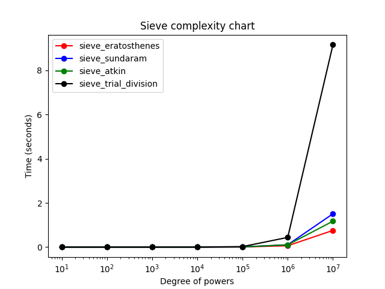
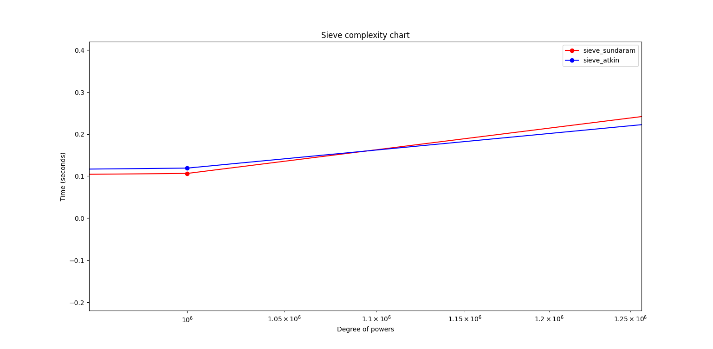

# Prime Sieves: A Comparative Analysis

This project compares four different algorithms and sieves for generating prime numbers:

- **Trial Division**
- **Sieve of Eratosthenes**
- **Sieve of Sundaram**
- **Sieve of Atkin**

This includes both theoretical and practical performance comparisons, along with two visual benchmarks showing runtime behavior across increasing prime input sizes.

---

## 🧮 Algorithm Overviews

### 1. Trial Division
The Trial Division algorithm is the most straightforward method for finding prime numbers. Give a number `n`, each number is checked individually by attempting division from `2` to `√n`.

- **Time Complexity:** O(n√n)
- **Pros:** Known for its simplicity.
- **Cons:** Extremely slow for larger values of `n`.

---

### 2. Sieve of Eratosthenes
The Sieve of Eratosthenes is an elegant algorithm which marks composite numbers in a boolean array up to `n`.

- **Time Complexity:** O(n log log n)
- **Pros:** Efficient and easy to implement.
- **Cons:** Ressource intensive for larger values since space is proportional to `n`.

---

### 3. Sieve of Sundaram
The Sieve of Sundaram eliminates numbers the form i + 2ij + j. It operates up to `n/2` and later transforms results to get the full prime set.

- **Time Complexity:** O(n log n)
- **Pros:** Slightly less space-intensive than Eratosthenes.
- **Cons:** More complex indexing, resulting in being less efficient in practice.

---

### 4. Sieve of Atkin
The Sieve of Atkin is a more modern approach using modular arithmetic, quadratic forms, and mathematical filters to identify primes.

- **Time Complexity:** O(n / log log n) *(in theory)*
- **Pros:** Asymptotically faster for large `n`, making it efficient for very large datasets.
- **Cons:** Complex to implement and very slow for small inputs due to overhead.

---

## 📊 Performance Graphs

### 🔽 `runtime_comparison.png`
This graph shows the actual time (in seconds) each sieve takes for increasing values of `n`.

- **Trial Division** quickly becomes impractical.
- **Sundaram** efficient at lower input sizes.
- **Atkin** only starts outperforming Sundaram at much larger input sizes, and outperforms Eratosthenes at absurdly high numbers (see Conclusion)
- **Eratosthenes** most efficient out of all.

  

---

### ⚡ `atkin_sundaram_intersection.png`
This graph zooms in on the crossover point where the Sieve of Atkin becomes faster than the Sieve of Sundaram.

- This threshold typically occurs at about ~1.1×10⁶
- While the Sieve of Atkin is theoretically faster, its practical advantage only appears with very large inputs.

  

---

## ✅ Conclusion

The best choice seems to be the sieve of Eratosthenes for all cases. However, looking at the sieve of Atkin's time complexity, we can see that it should surpass Eratosthenes at higher values. In fact, the value at which Atkin surpasses Eratosthenes is exactly n=10¹⁰. So if you are computing primes above this threshold, Atkin's the way to go!

One thing to point out is that I've only laid out the skeleton for this rough study. The code for all sieves are nowhere *near* as optimized. Feel free to try out your own version with numpy, bitarrays, or other solutions you may come up with!

---

## 📁 Files

**Algorithms**
- `sieve_trial.py`
- `sieve_eratosthenes.py`
- `sieve_sundaram.py`
- `sieve_atkin.py`

**Plot**
- `benchmark.py`

- `runtime_comparison.png`
- `atkin_sundaram_intersection.png`

---

## 🧠 Credits

Created as a benchmark comparison tool for prime sieving algorithms. Useful for students, researchers, and algorithm enthusiasts.

